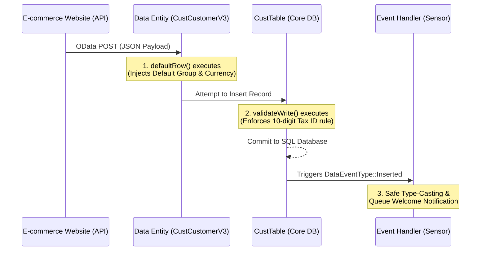

#  Project 1: Smart Customer Onboarding (Accounts Receivable)

##  Business Requirement
The company has launched a new e-commerce platform and requires customer data to flow automatically into Dynamics 365 Finance & Operations via API (OData). The architectural requirements are:
1. **Resiliency:** The system must not crash if the external website fails to provide complex ERP fields (e.g., Currency, Customer Group).
2. **Conditional Logic:** An "Email Address" is strictly mandatory *only* for customers originating from the website.
3. **Core Data Integrity:** The "Tax ID" (VAT Number) must be exactly 10 digits across the entire system (UI, Excel, API).
4. **Decoupled Actions:** A welcome notification must be triggered immediately after a successful database insertion, without locking the main transaction.

---

##  Architecture & Design Pattern
To satisfy these requirements without violating Microsoft's Best Practices, the solution is distributed across three distinct architectural layers (Separation of Concerns):

### 1. The API Gatekeeper (Data Entity Extension)
* **File:** `CustCustomerV3Entity_Extension`
* **Logic:** External systems do not understand D365's normalized structure. We use the `defaultRow` method to dynamically inject missing mandatory fields (like `CustomerGroupId` and `SalesCurrencyCode`) before the data hits the core validation. The entity-level `validateWrite` enforces the web-only Email rule.

### 2. The Core Guardian (Table Extension - CoC)
* **File:** `CustTable_MyCompany_Extension`
* **Logic:** The 10-digit Tax ID rule is universal. By extending the Table's `validateWrite` method via Chain of Command (CoC), we ensure no one can bypass this rule. We also optimized server performance by evaluating our custom logic *only* if the standard Microsoft validation `next validateWrite()` returns true.

### 3. The Decoupled Sensor (Event Handler)
* **File:** `CustTable_EventHandler`
* **Logic:** Sending a notification is a side-effect. Instead of customizing the `insert` method (which could rollback the transaction if the email server is down), we subscribe to the `onInserted` Data Event. This ensures the notification is queued *only* after the database lock is released.

---

##  Integration Workflow
Below is the sequence diagram illustrating how data travels from the external website down to the database:

## API Test Payload
To test this integration, external systems should send a POST request to the following endpoint:

Endpoint: [D365_Environment_URL]/data/CustCustomerV3Entities

JSON Payload:

JSON

{
  "CustomerAccount": "CUST-9001",
  "OrganizationName": "Novin Tech Solutions",
  "PrimaryContactEmail": "info@novin-tech.com",
  "TaxVATNum": "1234567890" 
}

(Note: CustomerGroupId and SalesCurrencyCode are intentionally omitted to demonstrate the Entity's auto-defaulting capabilities).

---

** Technical Q&A 
Q: Why enforce the Email rule on the Entity instead of the Table?

A: The business rule specifies that emails are mandatory only for web customers. Placing this rule on the CustTable would disrupt internal employees who manually create customers without immediate access to an email address. The Entity acts as the specific boundary for integration data.

Q: In your Event Handler, why use the as keyword instead of direct assignment?

A: The sender parameter is of type Common. Direct assignment is risky and can lead to runtime crashes. Using as allows for safe type-casting. Coupled with the defensive if (custTable) check, the code is immune to NullReferenceException.

Q: Why capture the result of next validateWrite() into a boolean variable first?

A: Performance optimization. If a user forgets a standard mandatory field (like Name), Microsoft's standard validation fails and returns false. By checking if (isValid) before executing custom logic, we prevent the CPU from running unnecessary string length calculations on a record that is already destined to be rejected.

---

## Deployment Instructions
To review or execute this code in a Dev Environment:

Download the provided .axpp file from this repository.

In Visual Studio, navigate to Dynamics 365 > Import Project.

Select the file, build the project, and perform a full Database Synchronization.
